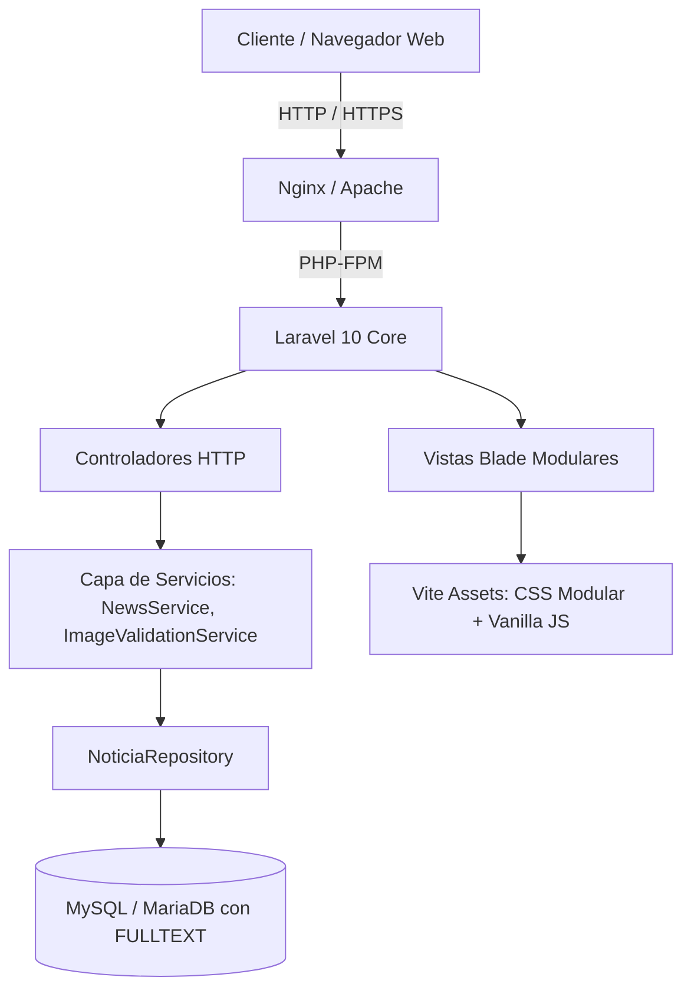

# Arquitectura del Sistema - Latitud 18

## 1. Visión General
**Latitud 18** es un portal periodístico y multimedios de alto rendimiento desarrollado sobre **Laravel 10** y **PHP 8.2+**, con frontend basado en **Blade + CSS modular compilado con Vite**.

---

## 2. Modelos y Base de Datos

### 2.1 Entidades Principales
- **`Noticia`**: Núcleo editorial. Maneja títulos, contenido HTML sanitizado, categorías, autores, imágenes destacadas, galerías, vistas, estado de publicación, programación futura (`publicar_en`) e índices FullText `(titulo, contenido)`.
- **`Category`**: Taxonomía editorial con soporte para `slug` amigable (e.g. `politica`, `economia`, `deportes`, `contraataque`).
- **`Comentario`**: Sistema de participación comunitaria con moderación administrativa previa y protección antispam.
- **`ReaccionNoticia`**: Registro de reacciones emocionales (`me_informa`, `interesante`, `me_indigna`, `recomiendo`) por dirección IP sin necesidad de autenticación forzada.
- **`NoticiaFoto`**: Fotografías secundarias para galerías multi-imagen con ordenamiento visual.
- **`NewsletterSubscriber`**: Suscriptores de boletín informativo con token de verificación y estado activo.
- **`SiteSetting`**: Configuración dinámica de enlaces de streaming en vivo (TV HD, Radio), tickers y banners.

---

## 3. Patrones de Diseño

### 3.1 Service & Repository Pattern
- **`NoticiaRepository`**: Encapsula todas las consultas Eloquent de noticias activas, búsquedas FullText, noticias destacadas, noticias relacionadas por categoría y estadísticas.
- **`NewsService`**: Orquesta la lógica de negocio, cacheo de consultas recurrentes en memoria/Redis, sanitización HTML de contenidos y validación de seguridad de URLs e imágenes.
- **`ImageValidationService`**: Validador de rutas de imágenes locales y remotas (`storage/`, `public/images/`) con fallback automático a placeholders elegantes para evitar imágenes rotas.

---

## 4. Enrutamiento y SEO Canónico

### 4.1 Estructura de URLs
- **Portada**: `/`
- **Categoría por Slug**: `/categoria/{slug}` (con redirección 301 automática si se accede vía ID numérico `/categoria/{id}`)
- **Detalle de Noticia Canónica**: `/{categoria}/{slug}/{id}`
- **Fallback Histórico**: `/noticia/{id}` ➔ Redirección HTTP 301 permanente a la URL canónica amigable.
- **Buscador en Tiempo Real**: `/buscar?q={termino}`
- **Sitemap Dinámico**: `/sitemap.xml` para indexación en Google / Bing.

---

## 5. Motor de Búsqueda de Alto Rendimiento

### 5.1 FullText Search (MySQL)
Para escalar a decenas de miles de noticias sin degradación de rendimiento:
1. **Índice FullText**: Creado sobre `(titulo, contenido)`.
2. **Relevancia Ponderada**: `(MATCH(titulo) * 2 + MATCH(contenido))` prioriza noticias con coincidencia en el titular.
3. **Fallback Automático**: Si el término tiene menos de 3 caracteres (siglas como "TV", "IA") o palabras ignoradas por stopwords de MySQL, el sistema conmuta transparentemente a búsqueda `LIKE` indexada.

---

## 6. Frontend y Componentes

### 6.1 Modularidad Blade
- Layout principal en `resources/views/layouts/main.blade.php` (81 líneas) dividida en componentes reutilizables:
  - `components/header.blade.php`: Ticker, fecha en vivo, redes y cabecera.
  - `components/navbar.blade.php`: Menú sticky y drawer móvil.
  - `components/footer.blade.php`: Pie editorial de 5 columnas.
  - `components/live-player.blade.php`: Reproductor TV HD + Radio streaming.
  - `components/newspaper-modal.blade.php`: Visor de periódico digital de 12 páginas.
  - `components/search-modal.blade.php`: Modal de búsqueda rápida AJAX.
  - `components/pwa-scripts.blade.php`: Service Worker PWA y tema oscuro/claro.
